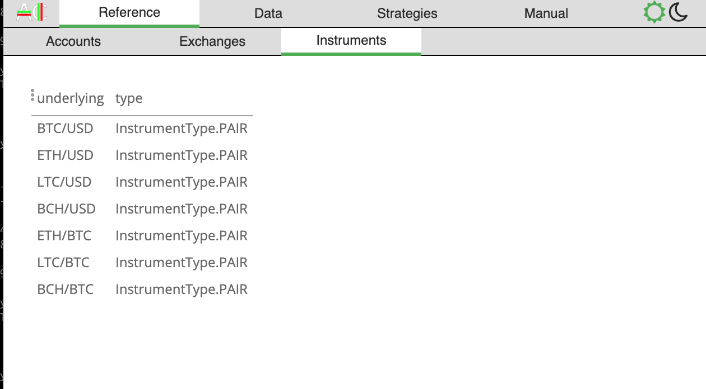

# AlgoCoin
AlgoCoin is a python library for writing trading algorithms. It is designed using a combination of asyncio and callbacks to make writing cross-asset, cross-currency, and cross exchange algorithms for backtesting and live trading as simple as possible. 

# WARNING: Code refactoring still in progress

[](https://travis-ci.org/timkpaine/algo-coin)
[](https://codecov.io/gh/timkpaine/algo-coin)
[](https://gitter.im/algo-coin/Lobby)
[](https://bettercodehub.com/)
[](https://pypi.python.org/pypi/algocoin)
[](https://pypi.python.org/pypi/algocoin)
[](http://algo-coin.readthedocs.io/en/latest/)

## Overview 
Lightweight, extensible program for algorithmically trading cryptocurrencies and derivatives across multiple exchanges. 

### System Architecture
AlgoCoin is an event based trading system written in python. It is built on [aat](https://github.com/timkpaine/aat).

### Markets
AlgoCoin will support all exchanges and currencies covered by [ccxt](https://github.com/ccxt/ccxt)

---

## Getting Started
### Installation
Install the library from pip:

```python
pip install algocoin
```

Install the library from source:

```python
python setup.py install
```

## Documentation
Refer to the documentation for [aat](https://github.com/timkpaine/aat).

## Screenshots
### Backtest
[]()

### UI
#### Accounts overview
[]()

#### Instrument registry
[]()

#### Live trades
[]()

#### Last price per asset/exchange
[]()

#### Strategy trade requests/trade results
[]()